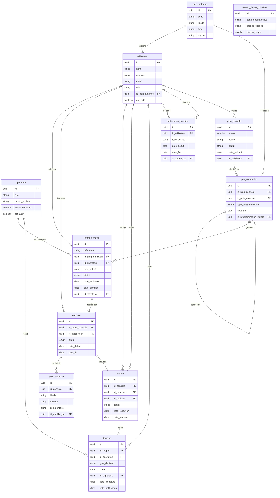

# Diagramme ERD

!!! warning "Statut : À valider"
    Ce diagramme couvre les entités du cycle de contrôle (PR-01).

```mermaid
erDiagram

    pole_antenne {
        uuid id PK
        string code
        string libelle
        string type
        string region
    }

    utilisateur {
        uuid id PK
        string nom
        string prenom
        string email
        string role
        uuid id_pole_antenne FK
        boolean est_actif
    }

    operateur {
        uuid id PK
        string siret
        string raison_sociale
        numeric indice_confiance
        boolean est_actif
    }

    plan_controle {
        uuid id PK
        smallint annee
        string libelle
        string statut
        date date_validation
        uuid id_validateur FK
    }

    programmation {
        uuid id PK
        uuid id_plan_controle FK
        uuid id_pole_antenne FK
        enum type_programmation
        date date_gel
        uuid id_programmation_initiale FK
    }

    niveau_risque_situation {
        uuid id PK
        string zone_geographique
        string groupe_espece
        smallint niveau_risque
    }

    ordre_controle {
        uuid id PK
        string reference
        uuid id_programmation FK
        uuid id_operateur FK
        string type_activite
        enum statut
        date date_emission
        date date_planifiee
        uuid id_affecte_a FK
    }

    controle {
        uuid id PK
        uuid id_ordre_controle FK
        uuid id_inspecteur FK
        enum statut
        date date_debut
        date date_fin
    }

    point_controle {
        uuid id PK
        uuid id_controle FK
        string libelle
        string resultat
        string commentaire
        uuid id_qualifie_par FK
    }

    rapport {
        uuid id PK
        uuid id_controle FK
        uuid id_redacteur FK
        uuid id_reviseur FK
        string statut
        date date_redaction
        date date_revision
    }

    decision {
        uuid id PK
        uuid id_rapport FK
        uuid id_operateur FK
        enum type_decision
        string statut
        uuid id_signataire FK
        date date_signature
        date date_notification
    }

    habilitation_decision {
        uuid id PK
        uuid id_utilisateur FK
        string type_activite
        date date_debut
        date date_fin
        uuid accordee_par FK
    }

    pole_antenne ||--o{ utilisateur : "rattache"
    pole_antenne ||--o{ programmation : "concerne"

    utilisateur ||--o{ ordre_controle : "affecte a"
    utilisateur ||--o{ controle : "inspecte"
    utilisateur ||--o{ rapport : "redige"
    utilisateur ||--o{ rapport : "revise"
    utilisateur ||--o{ decision : "signe"
    utilisateur ||--o{ habilitation_decision : "delegue"
    utilisateur ||--o{ habilitation_decision : "beneficie"
    utilisateur ||--o{ plan_controle : "valide"

    operateur ||--o{ ordre_controle : "fait l'objet de"
    operateur ||--o{ decision : "recoit"

    plan_controle ||--o{ programmation : "decliné en"

    programmation ||--o{ programmation : "ajustee de"
    programmation ||--o{ ordre_controle : "genere"

    ordre_controle ||--|| controle : "realise par"

    controle ||--o{ point_controle : "evalue via"
    controle ||--|| rapport : "aboutit a"

    rapport ||--|| decision : "fonde"
```
