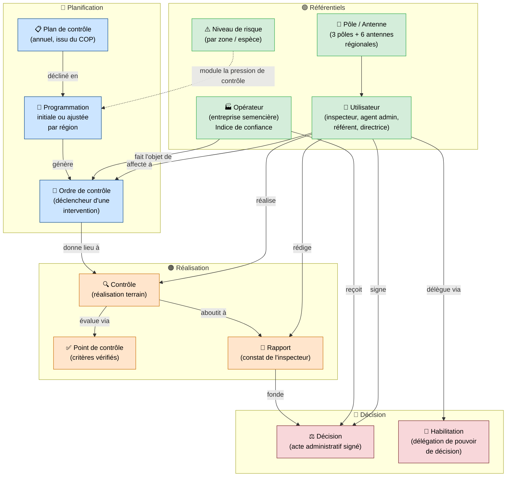

# Base de données — Vue métier

Vue simplifiée des grandes entités et de leurs relations, sans détail technique.
Les couleurs représentent les couches fonctionnelles du système.

---

## Légende des couches

| Couleur | Couche |
|---|---|
| 🟢 Vert | Référentiels (qui sont les acteurs ?) |
| 🔵 Bleu | Planification (que prévoit-on de faire ?) |
| 🟠 Orange | Réalisation (qu'a-t-on fait ?) |
| 🔴 Rouge | Décision (qu'a-t-on décidé ?) |

---

## Diagramme

---

## Description des entités en langage naturel

### 🟢 Référentiels — Qui sont les acteurs ?

**Utilisateur**
: Tout collaborateur Entreprise X intervenant dans le cycle de contrôle : inspecteur, agent administratif, référent technique régional ou national, directrice DQ.

**Pôle / Antenne**
: Les 9 entités organisationnelles de la DQ (3 pôles centraux + 6 antennes régionales). Chaque utilisateur y est rattaché.

**Opérateur**
: Une entreprise de la filière semences et plants. Chaque opérateur a un **indice de confiance** (historique de conformité) qui influence la fréquence et l'intensité des contrôles qui lui sont appliqués.

**Niveau de risque**
: Évaluation du risque associé à une zone géographique ou un groupe d'espèce. Module la pression de contrôle indépendamment de l'opérateur.

---

### 🔵 Planification — Que prévoit-on de faire ?

**Plan de contrôle**
: Document annuel listant tous les objectifs de contrôle, déclinés à partir des 5 programmes-cadres du COP signé avec l'État.

**Programmation**
: Déclinaison du plan de contrôle par région. En deux temps : une version **initiale** (fixe, début d'année) et des versions **ajustées** au fil des demandes des opérateurs.

**Ordre de contrôle**
: Instruction formelle de réaliser un contrôle sur un opérateur donné. Planifié et affecté à un inspecteur avant exécution.

---

### 🟠 Réalisation — Qu'a-t-on fait ?

**Contrôle**
: L'intervention terrain effectuée par un inspecteur. Suit l'ordre de contrôle.

**Point de contrôle**
: Chacun des critères vérifiés lors du contrôle (conforme / non conforme / sans objet).

**Rapport**
: Constat rédigé par l'inspecteur à l'issue du contrôle. Relu par le référent technique régional avant d'être transmis à la décision.

---

### 🔴 Décision — Qu'a-t-on décidé ?

**Décision**
: Acte administratif signé, fondé sur le rapport. Peut impacter les **droits de l'opérateur**, les **agréments** de ses personnels ou laboratoires, et son **indice de confiance**.

**Habilitation**
: Délégation formelle du pouvoir de décision accordée par la Directrice DQ à un collaborateur désigné, pour un périmètre d'activité et une durée définis.
