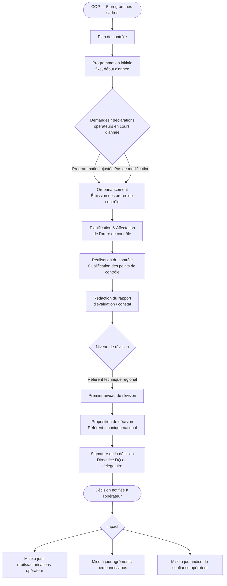

# PR-01 — Cycle de contrôle officiel

!!! warning "Statut : À valider"
    Ce document est en attente de relecture et validation par les sachants métier.

## Objectif

Décrire le cycle complet d'un contrôle officiel, depuis la définition du plan de contrôle annuel jusqu'à la signature de la décision administrative.

## Acteurs

| Acteur | Rôle dans ce processus |
|---|---|
| Directrice DQ | Organise le pouvoir de décision (RG-005) |
| Référent technique national | Propose les décisions d'autorisation ou agréments, pilote le système qualité |
| Référent technique régional | Supervise les inspecteurs, réalise le premier niveau de révision |
| Inspecteur | Réalise les contrôles, rédige les rapports, rend les décisions hors autorisations |
| Agent administratif | Vérifie les pièces et assure le traitement administratif des dossiers |
| Opérateur | Soumet les demandes et déclarations, met en œuvre les auto-contrôles |

## Enchaînement des étapes

## Description des étapes

### 1. Plan de contrôle

La DQ traduit les 5 programmes-cadres du [COP](../../glossaire.md#c) en objectifs de contrôle annuels. Ces objectifs sont déclinés pour l'ensemble des 37 activités de contrôle.

**Règles :**
- [RG-003](../regles-gestion/RG-003.md) — La pression de contrôle est modulée par l'analyse de risque et l'indice de confiance opérateur

### 2. Programmation

Déclinaison opérationnelle du plan de contrôle par région.

**2a. Programmation initiale** *(début d'année, fixe)*
: Qualification et quantification des interventions à prévoir sur l'année (type de contrôle, type d'opérateur, surfaces, volumes, nombre). Comparaison aux ressources disponibles par délégation.

- [RG-001](../regles-gestion/RG-001.md) — La programmation initiale est fixe et réalisée en début d'année

**2b. Programmation ajustée** *(au fil de l'eau)*
: Réajustement de la programmation initiale pour intégrer les demandes et déclarations ad hoc des opérateurs.

- [RG-002](../regles-gestion/RG-002.md) — La programmation ajustée intègre les demandes ad hoc des opérateurs en cours d'année

### 3. Ordonnancement

Émission des [ordres de contrôle](../../glossaire.md#o) en réponse aux demandes/déclarations des opérateurs ou à la programmation. Chaque ordre sera ensuite planifié et affecté à un agent.

### 4. Réalisation du contrôle

Un collaborateur DQ qualifie la liste des [points de contrôle](../../glossaire.md#p) définis par la procédure de l'activité concernée. Ces étapes aboutissent à la production d'un rapport d'évaluation ou constat.

### 5. Révision et décision

Le rapport est révisé par le référent technique régional (premier niveau), puis une décision est proposée par le référent technique national et signée conformément au pouvoir de décision organisé par la Directrice DQ.

- [RG-004](../regles-gestion/RG-004.md) — Toute décision doit être signée et peut impacter les droits, agréments ou l'indice de confiance
- [RG-005](../regles-gestion/RG-005.md) — Seule la Directrice de la DQ est habilitée à organiser le pouvoir de décision

### 6. Impacts de la décision

La décision peut avoir trois types d'impacts :

1. **Droits et autorisations** de l'opérateur (personne morale)
2. **Agréments et qualifications** des personnes physiques ou des laboratoires
3. **Indice de confiance** de l'opérateur (influence les contrôles futurs)

## Entités de données impliquées

| Entité | Table SQL | Rôle |
|---|---|---|
| Plan de contrôle | `plan_controle` | Objectifs annuels issus du COP |
| Programmation | `programmation` | Déclinaison régionale du plan |
| Ordre de contrôle | `ordre_controle` | Déclencheur d'un contrôle |
| Contrôle | `controle` | Réalisation effective |
| Point de contrôle | `point_controle` | Critère vérifié lors du contrôle |
| Rapport | `rapport` | Constat produit par l'inspecteur |
| Décision | `decision` | Acte administratif final |
| Opérateur | `operateur` | Personne morale contrôlée |

## Endpoints API liés

| Méthode | Endpoint | Description |
|---|---|---|
| `GET` | `/api/v1/plans-controle` | Liste les plans de contrôle |
| `POST` | `/api/v1/ordres-controle` | Crée un ordre de contrôle |
| `GET` | `/api/v1/ordres-controle/{id}` | Détail d'un ordre de contrôle |
| `PATCH` | `/api/v1/controles/{id}/statut` | Met à jour le statut d'un contrôle |
| `POST` | `/api/v1/controles/{id}/decisions` | Enregistre une décision |
